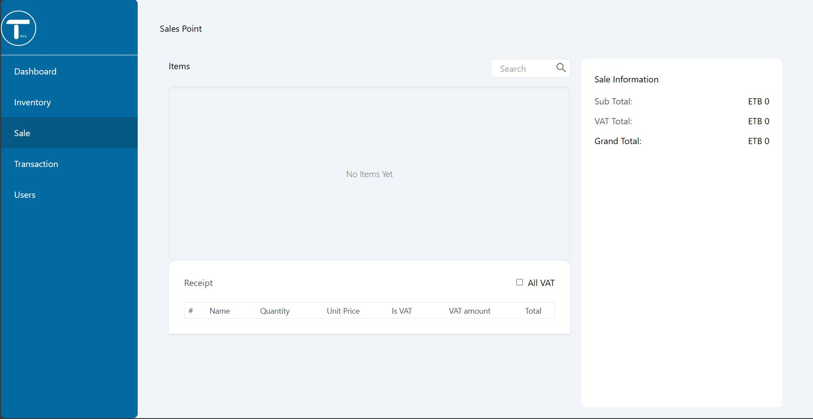

<h1>NestJS Prisma REST API With VueJS and Tailwind Inventory System</h1>
<h2>An Inventory system created with specifically the Ethiopian Financial system in mind!</h2>

<p>This project is a side hustle idea that was built for SME that require a digital ledger for their businesses with the Ethiopian tax laws in mind. <br/> 
The project has the following features included: <br/>
  <ul>
    <li>Save all the Items in your store in any unit required</li>
    <li>Register the Items when they enter the inventory</li>
    <li>Has a sales portal for when you sell your products</li>
    <li>Has a dashboard with the most important KPI's that can help your business</li>
    <li>Role based access control for signing up your employees and handing of selling activities</li>
  </ul>
</p>

## Installation

<h4>Backend Side</h4>
<p>1. Head into the backend directory <br/>
2. Run the following command</p>

```bash
$ npm install
```

<p>3. Run the Prisma seeding script to create your database</p>

```bash
$ npx prisma db pull
```
<p><b>Note:</b> For the above command to work you need to setup .env variables.</p>

<h4>Frontend Side</h4>
<p>1. Head into the frontend directory<br/>
2. Run the following command</p>

```bash
$ npm install
```

## Running the project
<p>Run in the backend directory the following command</p>

```bash
$ npm run start
```

<p>Run in the frontend directory the following command</p>

```bash
$ npm run serve
```

<p>The running system will look like this:</p>



<p>Simple Docker installation Comming Soon!!</p>


